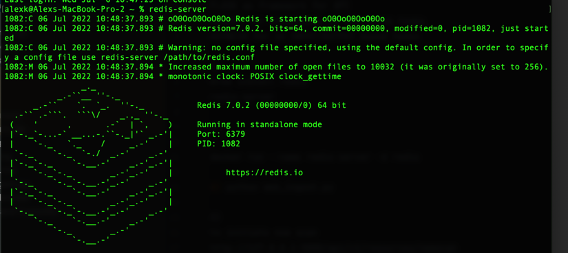
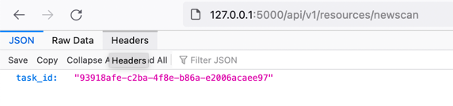
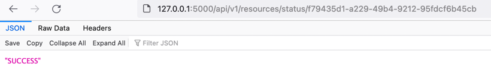
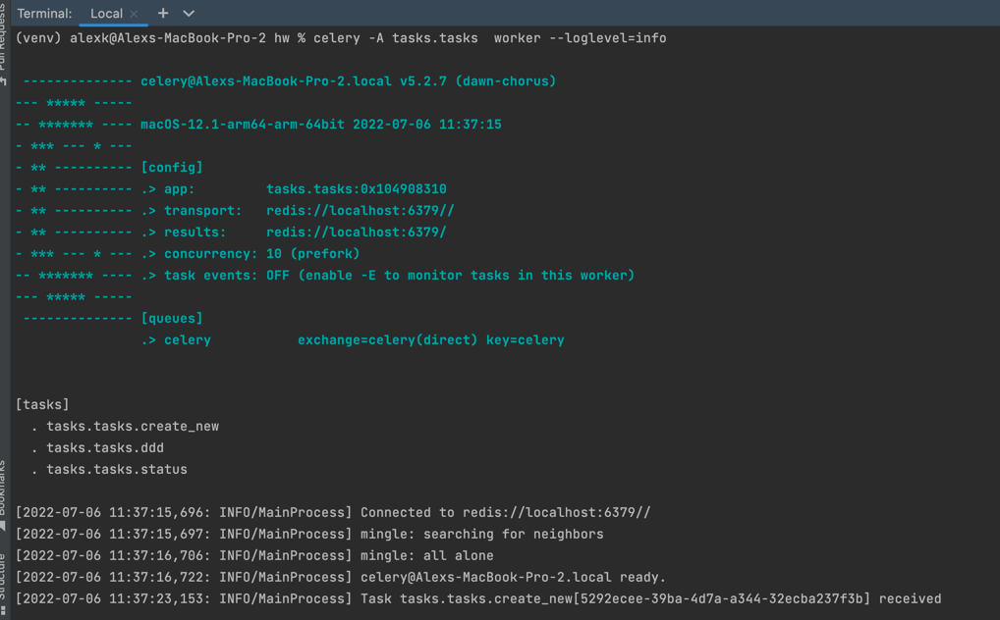

FLASK as framework for API

CELERY for efficiency in CPU bound tasks

ASYNCIO for in INPUT/OUTPUT bound tasks

HOW TO RUN: 

1)
brew install redis

redis-server

or

docker run --name redis-server -d redis

2) python web_ingest.py

3)
to initiate new scan
http://127.0.0.1:5000/api/v1/resources/newscan

to check scan status
http://127.0.0.1:5000/api/v1/resources/status/<scan_id>

celery -A tasks.tasks worker --loglevel=info

Ingest – The ingestion system must be able to receive multiple requests to initiate scans
in parallel (N) under load. Per request, the system must acknowledge the fact that the
request has been received and provide the caller with a unique scan-id that will be
assigned to each dispatched scan.

=> PRODUCER (CLIENT) RUNNING IN FLASK AND CREATING CELERY TASKS, MSG BROKER REDIS , TASK ID AS SCAN ID

Process – The dispatching system does not work under load, rather processes requests
at its own pace one by one.
(For efficiency, you may also implement an option for processing consecutive requests
in bulk)

=> CELERY WORKER (CONSUMER) EXECUTING TASKS

Status – an endpoint where a caller can check the status of a scan using the unique
scan-id it received from the ingestion system.

=> USING CELERY STATUSES , TASK ID AS SCAN ID

